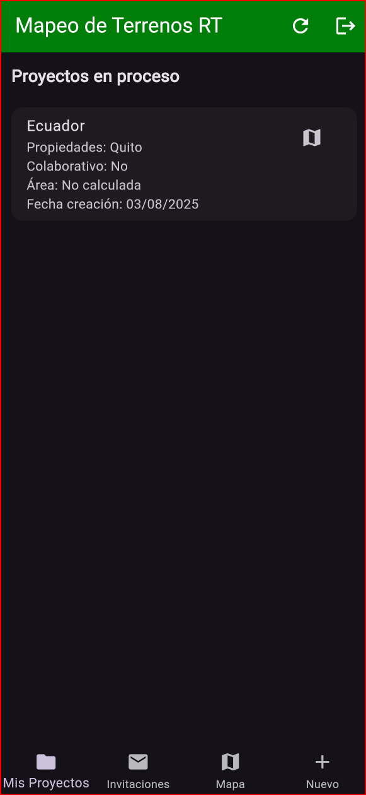
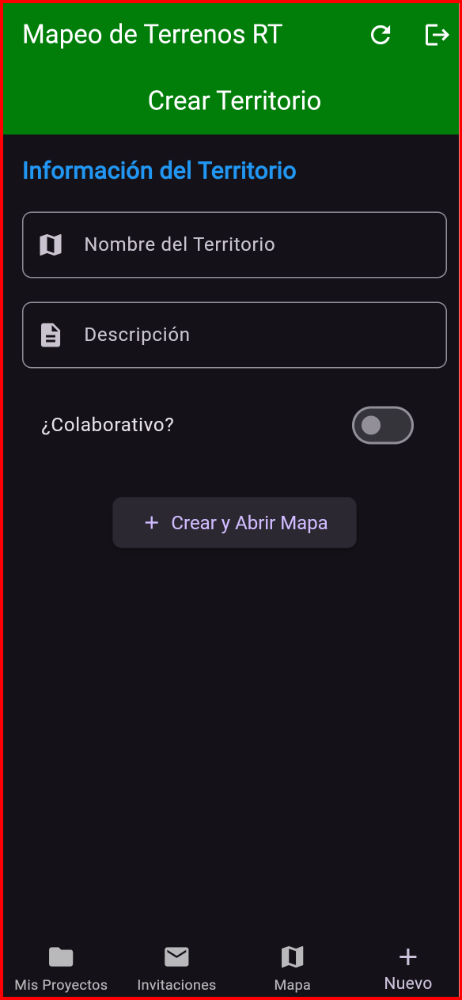
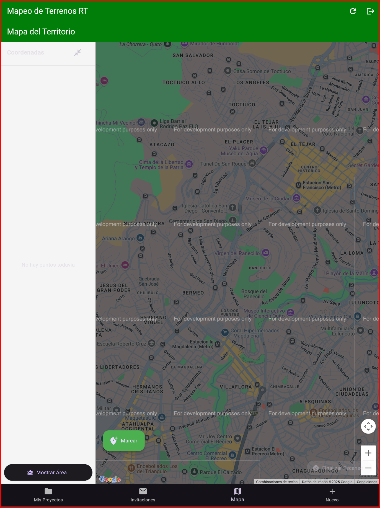

# Aplicación de Geolocalización de Topógrafos (mapeo_terrenos_rt)

Esta aplicación permite a los usuarios visualizar en tiempo real la ubicación de sus compañeros topógrafos sobre un mapa, además de registrar y gestionar terrenos con cálculo de área y seguimiento colaborativo.

---

## Funcionalidades implementadas

- **Login de usuarios**  
  Validación de usuarios para acceso seguro.

- **Sistema de administración (web/móvil)**  
  - Agregar, editar, desactivar usuarios y administradores.  
  - Visualizar ubicación en tiempo real de todos los topógrafos.

- **Visualización de terrenos**  
  - Polígonos definidos manualmente o automáticamente.  
  - Cálculo del área de los terrenos.  
  - Visualización de características y ubicación exacta.

- **Geolocalización en tiempo real**  
  - Uso de Google Maps para mostrar ubicación actual.  
  - Funciona en segundo plano, incluso cuando la app se minimiza.

- **Documentación y código en GitHub**  
  - Incluye capturas, video explicativo y archivo `.apk`.

- **Publicación en tienda de aplicaciones**  
  - Versión publicada en Google Play o tienda interna.

---

## Capturas de pantalla

Aquí se muestran algunas vistas de la aplicación:

  
  
  
  

En Progreso
  

---

## Tecnologías utilizadas

- Flutter + Supabase (Frontend y backend)
- Google Maps Flutter
- Dart
- Supabase PostgREST & RLS Policies
- GitHub para control de versiones

---

## Video explicativo

📽️ [Ver video en YouTube](https://youtu.be/...)  
Duración: 10 minutos

---

## Equipo de desarrollo

- Isaac Quinapallo
- Alejandro Gutierrez

---

## 📅 Entrega y defensa

- Entrega: `04/08/2025`  
- Defensa: `07/08/2025`  
- Oficina 28 – Revisión de entregables

---

## 📎 Archivos importantes

- `app-release.apk` – [Descargar APK](./apk/app-release.apk)
- `README.md` – Este archivo
- Código fuente – En este repositorio
